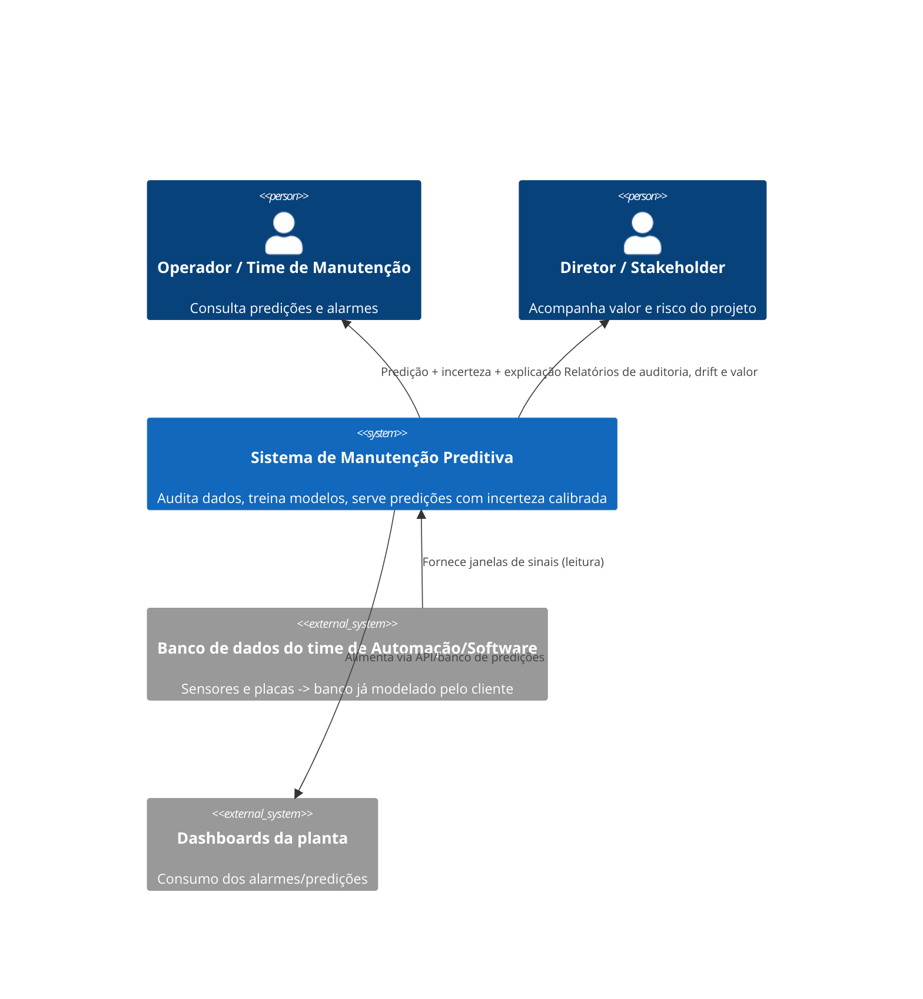
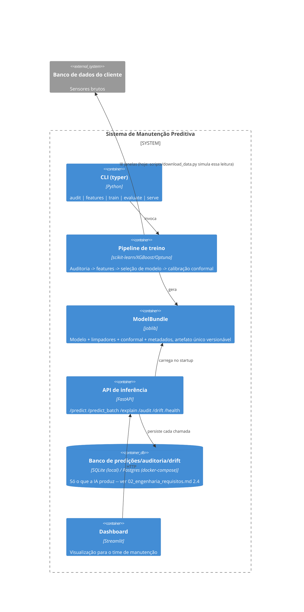
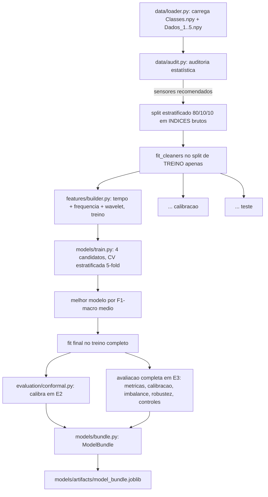
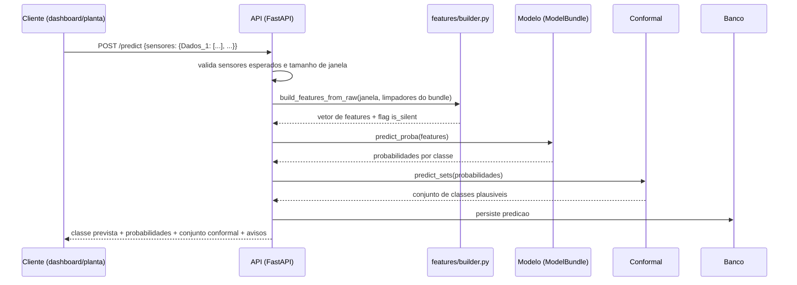

# 3. Arquitetura

## 3.1 Visão de contexto



## 3.2 Visão de containers (o que existe hoje na prévia)



## 3.3 Pipeline de treino (o que `python -m pdm.cli train` executa)



O ponto que mais separa este pipeline de uma implementação ingênua é o passo **D1**: os limiares de limpeza (saturação, silêncio — `preprocessing/cleaning.py`) são ajustados *só* com as linhas de treino e reaplicados sem reajuste em calibração/teste. Nas primeiras versões deste pipeline, esses limiares eram ajustados sobre o conjunto inteiro antes do split — um vazamento sutil (a etapa de limpeza "via" dados de calibração/teste antes de o modelo ser avaliado neles) que o próprio princípio de ceticismo deste projeto (ver `01_interpretacao_problema.md`) exigia corrigir. Ver `src/pdm/features/builder.py` para a separação explícita entre `fit_cleaners` (só treino) e `build_features_from_raw` (aplica limpadores já ajustados).

## 3.4 Pipeline de inferência (o que a API executa por requisição)



## 3.5 Mapa do repositório

```
src/pdm/
  config.py          Carrega configs/default.yaml (paths, seeds, limiares)
  cli.py             download-data | audit | features | train | evaluate | serve
  data/              loader.py (schema + validacao), audit.py (auditoria estatistica), io.py (cache com fallback)
  preprocessing/      cleaning.py (Hampel, NaN, silencio), dsp.py (deteccao/filtro/envelope/conversao de unidade)
  features/          time_domain.py, frequency_domain.py, wavelet.py, builder.py (fit/transform separados)
  models/            train.py (candidatos + wrapper XGBoost), tune.py (Optuna), pipeline.py (orquestracao), bundle.py, registry.py (MLflow ou fallback local)
  evaluation/        metrics.py, imbalance.py, robustness.py, explain.py, conformal.py, drift.py
  serving/           api.py, db.py, schemas.py, dashboard.py
notebooks/           01 auditoria, 02 analise de sinal, 03 viabilidade/modelagem, 04 avaliacao/robustez/explicabilidade, 05 demo da API
docs/                este diretorio
tests/               espelha src/pdm/, roda contra um fixture sintetico (nunca os ~380 MB reais)
docker/              Dockerfile.api, Dockerfile.dashboard, docker-compose.yml (api + dashboard + postgres)
```

## 3.6 Notas de plataforma (Windows ARM64 vs. Linux x86-64)

Este projeto foi desenvolvido numa máquina Windows ARM64 e validado continuamente num servidor Linux x86-64 (`ssh niko@niko-g3-3579`, Ubuntu, Docker Engine, GPU disponível para fases futuras de pesquisa) — os dois alvos de implantação declarados nos requisitos de software. Isso expôs, na prática, exatamente o tipo de risco de portabilidade que um projeto industrial real também enfrentaria (ambiente de desenvolvimento do cientista de dados ≠ ambiente de produção do cliente), e cada caso encontrado foi resolvido com um *fallback* documentado no código-fonte, não escondido:

| Dependência | Sintoma no Windows ARM64 | Causa raiz | Solução |
|---|---|---|---|
| `scipy>=1.18` | `DLL load failed` ao importar `scipy.stats` | Política de controle de aplicativos do Windows bloqueia uma extensão compilada específica (`_levy_stable`) | `requirements.txt` fixa `scipy<1.18` sem limite inferior — o pip resolve a versão mais nova compatível por interpretador (1.15.x em Python 3.10, 1.17.x em Python 3.12) |
| `mlflow`, `streamlit`, `shap`, `ssqueezepy` | Falha ao compilar (`pyarrow`/`numba`/`llvmlite` exigem toolchain C/C++ ausente) | Sem *wheel* pré-compilado para Windows ARM64 | Import opcional com *fallback*: `models/registry.py` usa um tracker local (JSON + joblib) quando `mlflow` falta; `evaluation/explain.py` usa importância por permutação quando `shap` falta; `features/wavelet.py` usa PyWavelets puro quando `ssqueezepy` falta. Todos os quatro foram confirmados funcionando no servidor Linux x86-64. |
| `pandas.to_parquet` | `ImportError: Unable to find a usable engine` | Também depende de `pyarrow` | `data/io.py` tenta Parquet primeiro e cai para um DataFrame serializado via `joblib` — mesma API, mesmos pontos de chamada |
| `psycopg2-binary` | Falha ao compilar (exige `pg_config`) | Driver de Postgres, sem *wheel* ARM64 | Não incluído em `requirements.txt` (quebraria a instalação local para uma funcionalidade — Postgres via Docker — que a máquina de desenvolvimento nunca usa); instalado diretamente em `docker/Dockerfile.api`, que só roda em Linux |

Esse padrão — nunca deixar uma dependência ausente quebrar o pipeline inteiro, sempre com uma explicação de causa raiz no código — é o mesmo princípio de ceticismo/robustez aplicado à engenharia de software em vez de aos dados.

## 3.7 Por que não uma rede neural profunda na prévia

Com ~50 mil janelas e um conjunto de features de engenharia de ~150 colunas por sensor retido, este não é um regime de dados escassos que justifique representation learning end-to-end como primeira escolha. Um ensemble de árvores (Random Forest / HistGradientBoosting / XGBoost) já atinge desempenho muito acima do acaso nesses dados (ver `models/artifacts/model_bundle.joblib` e os notebooks 03–04), com a vantagem de manter as features fisicamente nomeadas e a decisão auditável (importância de feature, SHAP, regras de árvore de decisão como baseline interpretável). Deep learning entra no roteiro de pesquisa (`06_track_pesquisa.md`) apenas onde ele tem uma vantagem real e documentada na literatura — aprendizado auto-supervisionado em dados saudáveis abundantes e reconhecimento *open-set* de falhas nunca vistas — não como substituição do que já funciona.
