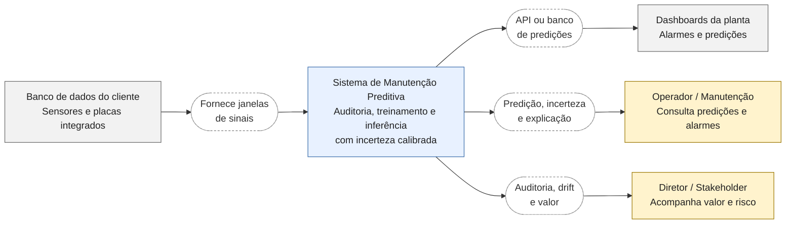
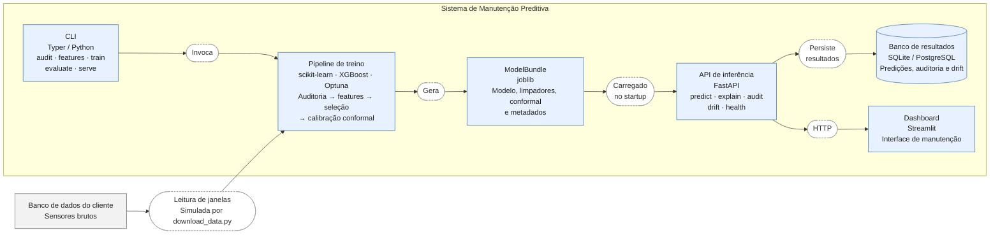
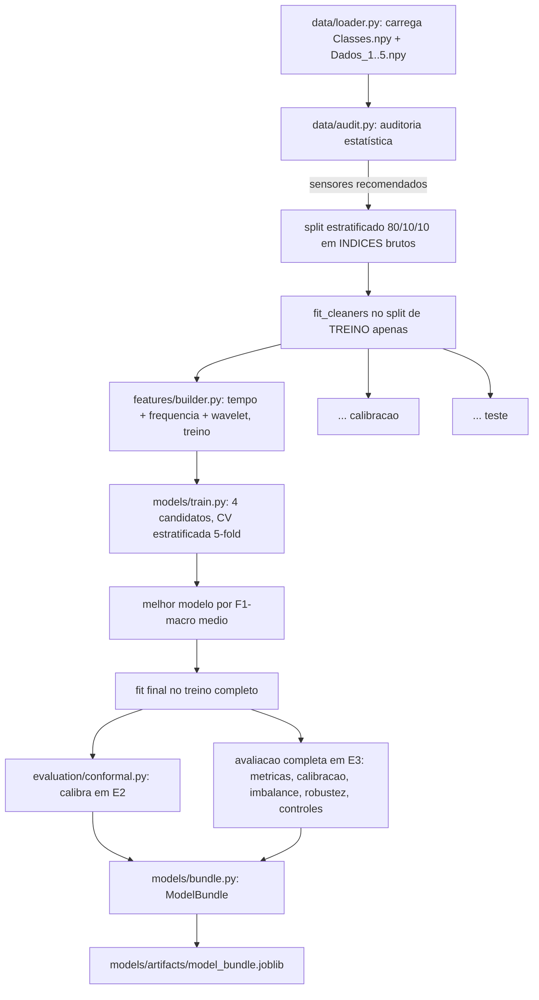
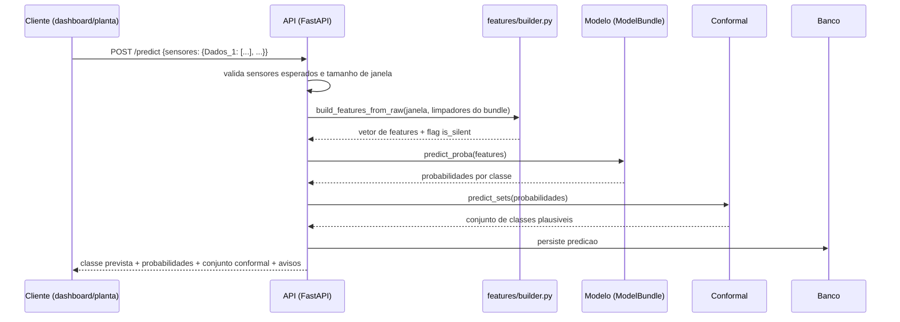

# 3. Arquitetura

## 3.1 Visão de contexto




## 3.2 Visão de containers (o que existe hoje na prévia)



## 3.3 Pipeline de treino (o que `python -m pdm.cli train` executa)



O ponto que mais separa este pipeline de uma implementação ingênua é o passo **D1**: os limiares de limpeza (saturação, silêncio, ver `preprocessing/cleaning.py`) são ajustados *só* com as linhas de treino, e reaplicados sem reajuste em calibração e teste. Ajustar esses limiares sobre o conjunto inteiro antes do split seria um vazamento sutil, já que a etapa de limpeza "veria" dados de calibração/teste antes de o modelo ser avaliado neles, e o próprio princípio de ceticismo deste projeto (ver `01_interpretacao_problema.md`) exige evitar exatamente esse tipo de vazamento. Ver `src/pdm/features/builder.py` para a separação explícita entre `fit_cleaners` (só treino) e `build_features_from_raw` (aplica limpadores já ajustados).

## 3.4 Pipeline de inferência (o que a API executa por requisição)



## 3.5 Mapa do repositório

```
src/pdm/
  config.py          Carrega configs/default.yaml (paths, seeds, limiares)
  cli.py             download-data | audit | features | train | evaluate | serve
  data/              loader.py (schema + validacao), audit.py (auditoria estatistica), io.py (cache com fallback)
  preprocessing/      cleaning.py (Hampel, NaN, silencio), dsp.py (deteccao/filtro/envelope/conversao de unidade)
  features/          time_domain.py, frequency_domain.py, wavelet.py, builder.py (fit/transform separados)
  models/            train.py (candidatos + wrapper XGBoost), tune.py (Optuna), pipeline.py (orquestracao), bundle.py, registry.py (MLflow ou fallback local)
  evaluation/        metrics.py, imbalance.py, robustness.py, explain.py, conformal.py, drift.py
  serving/           api.py, db.py, schemas.py, dashboard.py
notebooks/           01 auditoria + analise de sinal, 02 viabilidade/avaliacao/robustez/explicabilidade, 03 demo da API + banco
docs/                este diretorio
tests/               espelha src/pdm/, roda contra um fixture sintetico (nunca os ~380 MB reais)
docker/              Dockerfile.api, Dockerfile.dashboard, docker-compose.yml (api + dashboard + postgres)
```

## 3.6 Dependências opcionais e degradação graciosa

Algumas bibliotecas usadas neste projeto dependem de extensões compiladas ou de um *toolchain* C/C++ que nem todo ambiente de execução possui (uma imagem de produção mínima, por exemplo, pode não ter esses componentes). Por isso cada uma é tratada como *import opcional* com um *fallback* funcional e testado, nunca como uma falha que derruba o pipeline inteiro:

| Dependência | Papel principal | *Fallback* quando ausente |
|---|---|---|
| `mlflow` | Tracking de experimentos (parâmetros, métricas, artefato do modelo) | `models/registry.py` usa um tracker local (JSON + joblib) com a mesma interface |
| `shap` | Explicabilidade global/local via TreeExplainer | `evaluation/explain.py` usa LIME e, como último recurso, importância por permutação |
| `ssqueezepy` | Transformada wavelet *synchrosqueezed* para energia por escala | `features/wavelet.py` usa CWT via PyWavelets |
| `pyarrow` (`pandas.to_parquet`) | Cache de features em Parquet (menor, preserva dtypes) | `data/io.py` cai para um DataFrame serializado via `joblib` (mesma API) |
| `psycopg2-binary` | Driver de Postgres | Instalado apenas na imagem Docker da API (`docker/Dockerfile.api`), onde o Postgres realmente roda; a execução local usa SQLite |

**Todas as cinco foram confirmadas rodando de verdade** (não só instaladas) no servidor de testes usado para validar este projeto, com a stack completa (ver seção 3.7). Esse padrão (nunca deixar uma dependência ausente quebrar o pipeline inteiro, sempre com uma explicação de causa raiz no código): é o mesmo princípio de ceticismo/robustez aplicado à engenharia de software em vez de aos dados, e é o que torna o sistema resiliente a ambientes de implantação futuros mais restritos.

## 3.7 Execução completa (resultados principais)

`python -m pdm.cli train` foi executado do zero com a **stack completa** originalmente prevista (MLflow real para tracking de experimento, SHAP real para explicabilidade, ssqueezepy real para wavelet *synchrosqueezed*, além de scikit-learn/XGBoost/FastAPI): não os *fallbacks* da seção 3.6. Esta execução é a fonte dos números reportados como resultado principal desta prévia (ver `01_interpretacao_problema.md`, seção 1.5):

| Métrica | Resultado |
|---|---|
| Modelo vencedor | HistGradientBoosting |
| F1-macro (teste) | **0,9624** |
| ECE (calibração) | 0,0061 |
| Cobertura conformal @ alvo 0,90 | 0,8944 |
| Controle: rótulos embaralhados | 0,2001 (acaso = 0,20) |
| Controle: só sensor de ruído | 0,0667 |
| Tracker de experimento | MLflow real (run registrado) |
| Explicabilidade (`/explain`) | SHAP real (TreeExplainer) |

A execução completa levou **83 minutos**, quase inteiramente por conta do custo por linha da transformada *synchrosqueezed* do `ssqueezepy` sobre as 50 mil janelas × 3 sensores × 3 splits (o preço de usar a stack de pesquisa completa em vez do fallback de CWT simples do PyWavelets).

`models/bundle.py::ModelBundle` grava as versões exatas (Python/scikit-learn/XGBoost) usadas no treino dentro do próprio *bundle*, e `ModelBundle.load()` transforma uma incompatibilidade de versão numa mensagem acionável em vez de um traceback cru (um bundle só é portável entre ambientes que resolvem a mesma versão do scikit-learn, e essa verificação é o que torna essa restrição segura de detectar automaticamente em vez de falhar de forma silenciosa ou confusa em produção).

**`docker compose up` validado de ponta a ponta**: com acesso `sudo` ao Docker Engine do servidor, os três serviços (`api`, `dashboard`, `postgres`) sobem, o Postgres fica saudável, e uma chamada real a `POST /predict` retorna uma predição e grava a linha correspondente na tabela `predictions` do Postgres do contêiner (confirmado com `SELECT` direto no banco, não apenas pelo código de status HTTP): o requisito "plus" de API + banco de dados funciona containerizado, não só em execução local direta.

## 3.8 Por que não uma rede neural profunda na prévia

Com ~50 mil janelas e um conjunto de features de engenharia de ~150 colunas por sensor retido, este não é um regime de dados escassos que justifique representation learning end-to-end como primeira escolha. Um ensemble de árvores (Random Forest / HistGradientBoosting / XGBoost) já atinge desempenho muito acima do acaso nesses dados (ver `models/artifacts/model_bundle.joblib` e os notebooks 01–02), com a vantagem de manter as features fisicamente nomeadas e a decisão auditável (importância de feature, SHAP, regras de árvore de decisão como baseline interpretável). Deep learning entra no roteiro de pesquisa (`06_track_pesquisa.md`) apenas onde ele tem uma vantagem real e documentada na literatura (aprendizado auto-supervisionado em dados saudáveis abundantes e reconhecimento *open-set* de falhas nunca vistas), não como substituição do que já funciona.
