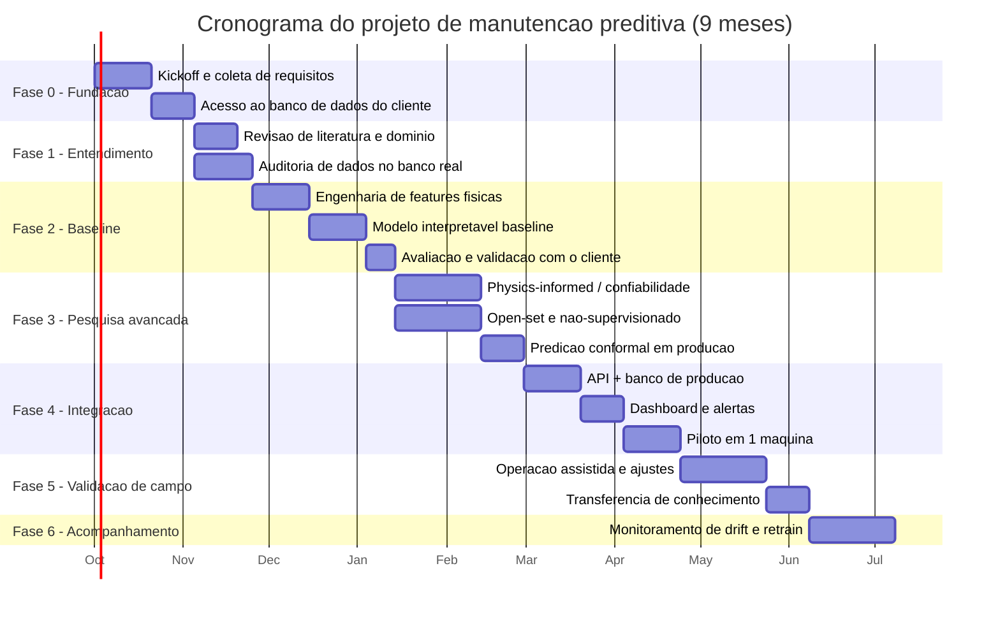

# 4. Arquitetura de projeto e cronograma de execução (caso contratado)

## 4.1 Premissas

- Escopo: **uma máquina/motor específico**, com os requisitos de dados de [`02_engenharia_requisitos.md`](02_engenharia_requisitos.md) (RD-01 a RD-07) atendidos até o fim da Fase 0.
- Equipe: 1 mentor/líder técnico de IA (tempo parcial, decisões de arquitetura e revisão), 2 engenheiros de ML/dados (tempo integral), 1 engenheiro de integração/backend (tempo parcial a partir da Fase 4), apoio pontual do time de automação/manutenção do cliente.
- Duração total: **9 meses**. Esse prazo é deliberadamente contido: para uma solução especializada numa única máquina, com um time bem mentorado e os requisitos de dados atendidos, um cronograma mais longo indicaria escopo mal definido, não rigor.
- O que muda esse prazo: se os requisitos de dados (RD-01–RD-07) não forem atendidos na Fase 0, ou se o cliente quiser escalar para múltiplas máquinas/tipos de ativo dentro do mesmo contrato, o cronograma deve ser renegociado — não espremido.

## 4.2 Fases

## 4.3 Estrutura analítica do projeto (WBS resumida)

1. **Fase 0 — Kick-off e requisitos (mês 1)**
   - Reunião de descoberta com automação, manutenção e TI do cliente.
   - Fechamento formal de RD-01 a RD-07 (`02_engenharia_requisitos.md`).
   - Acesso de leitura ao banco de dados existente (não a novos arquivos `.npy`).
   - **Marco M0**: requisitos de dados assinados pelas partes; acesso ao banco liberado.
2. **Fase 1 — Entendimento do domínio (mês 2)**
   - Revisão de literatura de diagnóstico da máquina/família de falha específica (ver `08_revisao_literatura.md`).
   - Reexecução da auditoria de dados (`src/pdm/data/audit.py`) contra o volume real do banco do cliente, não a amostra curada do case.
   - **Marco M1**: relatório de auditoria + lista de sensores validados/descartados para essa máquina específica.
3. **Fase 2 — Baseline interpretável (meses 3–4)**
   - Engenharia de features com significado físico (unidades reais, via `UnitConverter` já preparado em `preprocessing/dsp.py`, agora com sensibilidades reais).
   - Modelo baseline (árvore/ensemble), replicando a metodologia desta prévia com os dados reais e prior de classes real.
   - Validação cruzada com o time de manutenção: as classes/estados batem com o que eles observam em campo?
   - **Marco M2**: baseline aprovado pelo cliente como "digno de confiança para operar em modo sombra".
4. **Fase 3 — Track de pesquisa avançada (meses 4–6, em paralelo à Fase 2 tardia)**
   - Hipóteses H1–H8 de `06_track_pesquisa.md`: *physics-informed models*, aprendizado não/semi/auto-supervisionado, reconhecimento *open-set*, predição conformal calibrada em produção.
   - Critério de promoção: uma técnica de pesquisa só substitui o baseline se ganhar em robustez/generalização *e* manter (ou melhorar) a interpretabilidade — nunca troca-se uma métrica pontual melhor por uma caixa preta pior.
   - **Marco M3**: decisão documentada de quais técnicas avançadas entram em produção.
5. **Fase 4 — Integração e piloto (meses 6–7)**
   - API de inferência e banco de dados de predição/auditoria/drift em produção (arquitetura já prototipada nesta prévia, `src/pdm/serving/`).
   - Dashboard para o time de manutenção (extensão do protótipo Streamlit ou integração com o BI já usado pelo cliente).
   - Piloto controlado em uma máquina real, em paralelo ao processo de manutenção atual (não substituindo-o ainda).
   - **Marco M4**: piloto rodando em produção-sombra por ≥ 30 dias sem incidentes de infraestrutura.
6. **Fase 5 — Validação de campo e transferência (mês 8)**
   - Comparação sistemática entre alarmes do modelo e eventos reais de manutenção/falha.
   - Treinamento do time interno do cliente (operação, leitura de alarmes, quando escalar para o time de IA).
   - **Marco M5**: aceite formal do cliente para operação assistida (não mais sombra).
7. **Fase 6 — Acompanhamento e evolução (mês 9 em diante, contrato de sustentação)**
   - Monitoramento contínuo de *drift* (`evaluation/drift.py` já implementado), gatilhos de retrain (ver `09_mlops.md`).
   - Ciclo de melhoria contínua alimentado pelo track de pesquisa.

## 4.4 Esforço estimado (pessoa-mês, ordem de grandeza)

| Fase | Duração | Líder técnico | Eng. ML/dados (x2) | Eng. integração |
|---|---|---|---|---|
| 0 — Requisitos | 1 mês | 0,3 | 0,5 | — |
| 1 — Entendimento | 1 mês | 0,2 | 1,0 | — |
| 2 — Baseline | 2 meses | 0,4 | 2,0 | — |
| 3 — Pesquisa | 2 meses (paralelo) | 0,6 | 2,0 | — |
| 4 — Integração | 1,5 mês | 0,3 | 1,0 | 1,0 |
| 5 — Validação | 1 mês | 0,3 | 0,5 | 0,5 |
| 6 — Acompanhamento (mês 9+) | contínuo | 0,1/mês | 0,3/mês | 0,2/mês |

Esse esforço é a base para a proposta comercial que acompanha este documento nos slides executivos — não é repetido aqui em valores monetários porque esses dependem de taxas contratuais do SENAI SC que não fazem parte do escopo técnico desta prévia.
